# Agent Chat Workflow

Agent Chat provides a centralized conversational interface for understanding a specific agent and the wider tenant workspace. It is **read-only** — users can ask questions but cannot make changes through this interface (changes go through Role Chat or Plan Mode).

## Prerequisites

- Backend is running (`cargo run`)
- An `AgentDefinition` exists for the target agent
- LLM provider credentials are configured

## Steps

1. **User Opens Agent Chat**
   - Frontend sends the user's message to the agent chat endpoint
   ```
   POST /agents/:agent_id/chat
   Body: { "message": "...", "conversation": [...] }
   ```

2. **Build Workspace Context**
   - `AgentChatManager.build_context()` loads:
     - **Agent definition**: name, status, persona, connectors, constraints, memory_ref
     - **Roles**: all roles with trigger, connector, output summaries
     - **Recent runs**: last 12 goal instances with status, cost, failure reasons
     - **Other agents**: up to 8 other agents in the tenant with role counts

3. **Construct LLM Prompt**
   - System prompt injects full workspace context
   - Conversation history (user + assistant messages) appended
   - New user message appended last

4. **LLM Response**
   - `GatewayRequest` sent with `TaskComplexity::Medium`
   - LLM answers based on concrete facts from context
   - If information is missing, says so plainly instead of inventing

5. **Return Response**
   - Trimmed response returned to frontend
   - Conversation history maintained client-side for multi-turn context

## What Users Can Ask About

- **Agent overview**: "What does this agent do?"
- **Role details**: "How is the lead enrichment role configured?"
- **Run history**: "Why did the last run fail?"
- **Cross-agent context**: "What other agents are in this workspace?"
- **Blockers**: "What's preventing this agent from running?"
- **Costs**: "How much did the last 5 runs cost?"

## Key Differences from Role Chat

| Feature | Agent Chat | Role Chat |
|---------|------------|-----------|
| Scope | Full agent + tenant workspace | Single role |
| Changes | ❌ Read-only | ✅ Can propose & apply changes |
| Run detail | Last 12 runs (all roles) | Last 10 runs (single role) |
| Cross-agent | ✅ Shows other agents | ❌ Role-scoped only |

## Key Files

- `src/agent/agent_chat.rs` — AgentChatManager, context building, formatting helpers

## Notes

- Agent chat sees the full workspace including all roles and other agents
- If the user asks about changes, it suggests using Role Chat or Plan Mode instead
- Conversation history is passed from the client — no server-side session persistence
- The LLM is instructed to prefer concrete facts and avoid inventing information

---

## Flow Diagram

```mermaid
flowchart TD
    Start([User Opens Agent Chat]) --> SendMsg["User sends message<br/>POST /agents/:id/chat"]

    SendMsg --> BuildCtx["build_context()"]

    BuildCtx --> LoadAgent["Load AgentDefinition<br/>name, status, persona,<br/>connectors, constraints"]
    LoadAgent --> LoadRoles["Load all AgentRoles<br/>trigger, connectors, output"]
    LoadRoles --> LoadRuns["Load recent GoalInstances<br/>last 12 runs with status/cost"]
    LoadRuns --> LoadOther["Load other agents<br/>up to 8 in tenant"]

    LoadOther --> FormatCtx["Format workspace context<br/>agent + roles + runs + others"]

    FormatCtx --> BuildPrompt["Construct LLM messages"]
    BuildPrompt --> SysPrompt["System prompt:<br/>workspace context +<br/>behavior rules"]
    SysPrompt --> ConvHistory["Append conversation<br/>history"]
    ConvHistory --> UserMsg["Append new<br/>user message"]

    UserMsg --> GatewayReq["GatewayRequest<br/>TaskComplexity::Medium"]
    GatewayReq --> LLMCall["LLM generates response<br/>based on facts from context"]

    LLMCall --> CheckInfo{"Information<br/>available?"}
    CheckInfo -->|Yes| FactResponse["Return concrete<br/>factual answer"]
    CheckInfo -->|No| HonestGap["State gap plainly<br/>no invention"]

    FactResponse --> Return["Return trimmed response<br/>to frontend"]
    HonestGap --> Return

    Return --> UserDecision{"User continues<br/>conversation?"}
    UserDecision -->|Yes| SendMsg
    UserDecision -->|Wants changes| Redirect["Suggest Role Chat<br/>or Plan Mode"]
    UserDecision -->|No| Done([Chat Complete ✓])

    Redirect --> Done

    style Start fill:#1a1a2e,stroke:#e94560,color:#fff
    style Done fill:#0f3460,stroke:#16c79a,color:#fff
    style BuildCtx fill:#162447,stroke:#e2b93b,color:#fff
    style LLMCall fill:#1a1a2e,stroke:#e94560,color:#fff
    style Return fill:#1a1a2e,stroke:#16c79a,color:#fff
    style Redirect fill:#162447,stroke:#e2b93b,color:#fff
```


