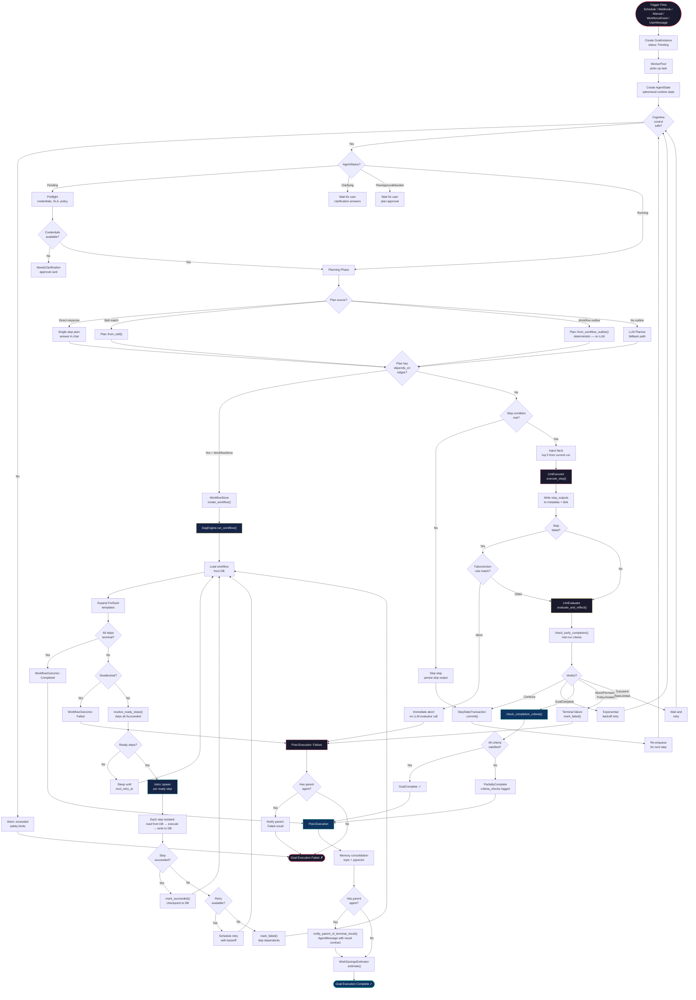

# Goal Chat / Agent Runtime Workflow

The Goal Chat workflow describes how a triggered agent role executes its goal at runtime. This is the core execution engine — the `AgentLoop` state machine driven by the `WorkerPool`, with optional DAG engine routing for parallel workflows.

## Prerequisites

- Agent role is saved and active (via Plan Mode)
- Trigger fires (schedule, webhook, user message, manual, or workforce event)
- WorkerPool has available capacity
- LLM provider credentials configured

## Steps

### Phase 1: Trigger & Dispatch

1. **Trigger fires** — cron scheduler, webhook handler, manual API call, or workforce event
2. **GoalInstance created** — status `Pending`, stored in PostgreSQL
3. **Task enqueued** — WorkerPool picks up the task asynchronously
4. **AgentState created** — ephemeral runtime state with goal, role config, workspace path

### Phase 2: AgentLoop.run_step()

5. **Cognitive control check**
   - `CognitiveControlLoop.should_continue()` — prevents infinite loops
   - Safety limits: max steps (50) and timeout (300s)

6. **Preflight (first run only)**
   - Credential checks, SLA setup, role-policy validation
   - If missing credentials → `NeedsClarification` with approval card

7. **Planning**
   - Priority order:
     1. Direct-response fast path (simple conversational requests)
     2. Pre-built skill match from `SkillRegistry`
     3. `Plan::from_workflow_outline(role)` — deterministic, no LLM call
     4. LLM planner fallback — only when no workflow outline exists
   - Plan approval gate if configured → `PlanApprovalNeeded`

8. **DAG routing check**
   - If plan has `depends_on` edges + `workflow_store` available:
     - Create `Workflow` and persist via `WorkflowStore.create_workflow()`
     - Delegate to `DagEngine.run_workflow()` (see Phase 3)
   - Otherwise: linear step-by-step execution continues

### Phase 2b: Linear Execution Path

9. **Step condition evaluation**
   - Check `StepCondition` (exists, equals, contains, gt, lt) against state metadata
   - Skip step if condition not met

10. **Clarification gate**
    - If needed: pause and return `NeedsClarification` with specific questions

11. **Inject facts**
    - Top 5 recent facts from current run (optimized — not all historical)
    - Knowledge graph + vector store retrieval

12. **Execute step**
    - `LlmExecutor.execute_step()` — tool calls, LLM interaction
    - Write `step_outputs` to state metadata (items_processed + connector_writes)
    - Persist full output to disk artifact file

13. **FailureAction check (pre-evaluator)**
    - `check_failure_rules_for_deterministic_abort()` BEFORE evaluator LLM call
    - `Abort` → immediate return, no LLM call (saves 10-15% unnecessary calls)

14. **Evaluate & Reflect**
    - `LlmEvaluator.evaluate_and_reflect()` — verdict on step quality
    - Early completion check: `check_early_completion()` mid-run

15. **Verdict dispatch**
    - `Continue` → re-enqueue for next step
    - `Retry` → exponential backoff and retry
    - `GoalComplete` → completion criteria check
    - `Abort` / `PermanentError` / `PolicyViolation` → terminal failure
    - `TransientError` → wait and retry
    - `RateLimited` → wait specified duration

16. **Atomic save**
    - `StepStateTransaction.commit()` — all metadata mutations at once
    - Crash-safe: either all changes commit or none do

17. **Completion path**
    - `check_completion_criteria()` → `Complete` or `PartiallyComplete`
    - Write `criteria_checks` to `goal_instance.result`
    - Fire-and-forget savings estimation

### Phase 3: DAG Engine Path (Parallel Workflows)

18. **Workflow loading**
    - Load fresh workflow state from DB (single source of truth)
    - Expand any `ForEach` templates that are ready

19. **Deadlock detection**
    - If no steps can ever progress → `Deadlocked` with blocked step IDs

20. **Ready step resolution**
    - Find steps whose predecessors all `Succeeded` and retry time has elapsed
    - Fan-out: independent steps execute concurrently via `tokio::spawn`
    - Fan-in: step waits until ALL predecessors succeed

21. **Parallel execution**
    - Each step is isolated: reads from DB, writes output to DB
    - No shared mutable state — `AgentState` is config/identity only
    - Step artifacts written to `_dag/step_{index}/output.json`

22. **Cycle loop**
    - Continue scheduling cycles until all steps are terminal
    - Sleep between cycles respecting `next_retry_at` timestamps

### Phase 4: Post-Execution

23. **Memory consolidation**
    - `MemoryConsolidator.consolidate_agent()` — topic memory + pgvector
    - Fire-and-forget, best-effort

24. **Parent notification** (if child agent)
    - `notify_parent_of_terminal_result()` — structured result contract
    - AgentMessage persisted to Postgres with status, artifacts, findings, confidence

25. **Savings estimation**
    - `WorkSavingsEstimator.estimate()` — human hours/cost saved
    - Written to `goal_instance.human_hours_saved` and `human_cost_saved_usd`

## Key Files

- `src/agent/loop.rs` — AgentLoop state machine, StepOutcome, StepStateTransaction
- `src/agent/dag_engine.rs` — DagEngine, parallel execution, CycleOutcome
- `src/agent/dag.rs` — Workflow, StepNode, StepStatus, ForEach expansion
- `src/agent/executor.rs` — LlmExecutor, tool calls, step execution
- `src/agent/evaluator.rs` — LlmEvaluator, CompletionCriteria checks
- `src/agent/planner.rs` — Plan, PlannedStep, Plan::from_workflow_outline()
- `src/agent/preflight.rs` — Credential checks, SLA setup
- `src/agent/step_artifacts.rs` — Per-step output files
- `src/worker/` — WorkerPool, task queue consumer

## Notes

- The worker is agnostic to whether a workflow is linear or DAG-based
- `AgentState` is config/metadata/identity only — NOT a data pipeline
- Step history is capped at `STEP_HISTORY_CAP = 30` to prevent unbounded growth
- Conversation history is bounded to prevent LLM context window overflow
- Custom tool policy is strict: `create_workspace_tool` blocked at runtime

---

## Flow Diagram

