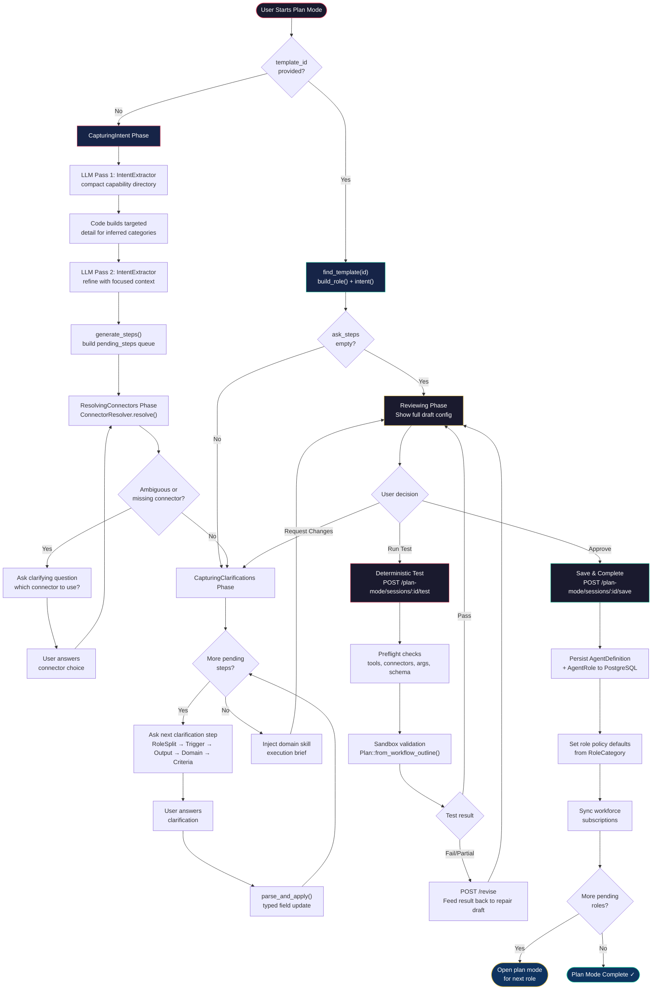

# Plan Mode Workflow

Plan mode is the one-time conversational setup phase where a user describes what an agent role should do in plain business language. The LLM infers the workflow, asks clarifying questions, and produces a fully configured `AgentRole`.

## Prerequisites

- Backend is running (`cargo run`)
- PostgreSQL database is available
- At least one LLM provider credential is configured

## Steps

1. **Create a Plan Mode Session**
   ```
   POST /plan-mode/sessions
   Body: { "tenant_id": "<tenant>", "agent_id": "<agent_id>", "description": "..." }
   ```
   - Optionally pass `template_id` to use the template fast-path (skips CapturingIntent)

2. **CapturingIntent Phase**
   - LLM Pass 1: `IntentExtractor.extract_initial()` with compact capability directory
   - Code builds targeted detail for inferred categories/candidates
   - LLM Pass 2: `IntentExtractor.refine()` with focused tool/connector detail
   - `generate_steps()` fills the `pending_steps` queue in the session

3. **ResolvingConnectors Phase**
   - `ConnectorResolver.resolve()` maps intent to specific connector names + tool overrides
   - If ambiguous: asks clarifying question (multiple connectors in same category, missing DB/API/MCP, etc.)
   - Handles: external_db, external_api, MCP server, built-in connector disambiguation

4. **CapturingClarifications Phase**
   - One step per turn from the `pending_steps` queue
   - Step order: RoleSplit → WorkforceEventFilter → Trigger → OutputDestination → Domain steps → CompletionCriteria
   - Domain skill execution brief injected via `ExecutionGuidelines::from_skill_text()`
   - Default completion criteria generated if none set

5. **Reviewing Phase**
   ```
   POST /plan-mode/sessions/:id/turn
   Body: { "message": "looks good" }
   ```
   - Shows full draft config as a review card
   - User confirms, requests changes, or runs deterministic test

6. **Test & Repair (Optional)**
   ```
   POST /plan-mode/sessions/:id/test
   ```
   - Preflight checks: tool existence, connector setup, args, schema
   - Sandbox: `Plan::from_workflow_outline(role)` — never calls LLM planner
   - If `fail` or `partial`: `POST /plan-mode/sessions/:id/revise` to repair the draft

7. **Save & Complete**
   ```
   POST /plan-mode/sessions/:id/save
   ```
   - Persists `AgentDefinition` + `AgentRole` to PostgreSQL
   - Sets role policy defaults from `RoleCategory`
   - Syncs workforce subscriptions if trigger is WorkforceEvent
   - Session snapshot preserved for repair reuse via `goal_fingerprint`

## Key Files

- `src/agent/plan_mode.rs` — main PlanModeManager, IntentExtractor, ConnectorResolver
- `src/agent/plan_mode_steps.rs` — ClarificationStep pipeline and `generate_steps()`
- `src/agent/templates.rs` — 23 pre-built RoleTemplates (template fast-path)
- `src/agent/definition.rs` — AgentRole, ExecutionGuidelines, WorkflowStep, TriggerDef
- `src/agent/planner.rs` — Plan data model, `Plan::from_workflow_outline()`

## Notes

- Plan mode does NOT execute tools — its job is to infer durable policy and scope
- Template fast-path skips CapturingIntent entirely (0 LLM calls for setup)
- Multi-role sessions stash pending roles in `draft_agent.memory_ref` as `|pending_roles:[...]`
- Save is a soft gate: non-pass test results show a warning but user can override

---

## Flow Diagram


