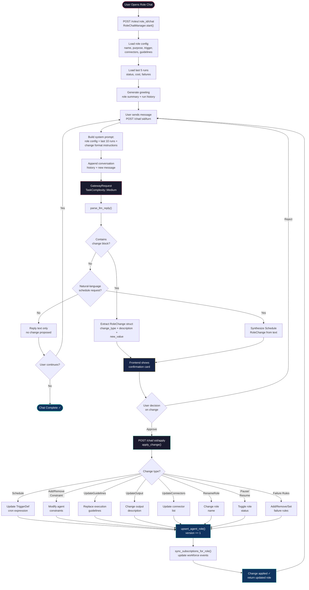

# Role Chat Workflow

Role Chat provides a conversational interface for understanding and **modifying** an existing `AgentRole`. Unlike Agent Chat (read-only), Role Chat can propose and apply configuration changes through a safe confirmation card workflow.

## Prerequisites

- Backend is running (`cargo run`)
- An `AgentRole` exists (created via Plan Mode)
- LLM provider credentials are configured

## Steps

### Phase 1: Start Session

1. **Start a role chat session**
   ```
   POST /roles/:role_id/chat
   ```
   - `RoleChatManager.start()` loads role config + last 5 run records
   - Returns a greeting with role summary, trigger, connectors, run history
   - Session created with UUID, stored in `role_chat_sessions` table

### Phase 2: Conversation Turns

2. **User sends a message**
   ```
   POST /roles/:role_id/chat/:sid/turn
   Body: { "message": "..." }
   ```

3. **Build system prompt**
   - Role configuration: name, purpose, status, trigger, connectors, guidelines, output
   - Recent runs: last 10 with timestamp, status, cost, failure reason
   - Instructions for proposing changes via `\`\`\`change` blocks

4. **LLM response**
   - Answers questions about role config, run history, failures
   - If user asks for a change: proposes it in text AND outputs a structured `\`\`\`change` JSON block

5. **Parse LLM reply**
   - `parse_llm_reply()` splits text from change block
   - If `\`\`\`change` block found → parse `RoleChange` struct
   - Fallback: natural-language schedule detection if LLM forgot the format
   - Returns `(reply_text, Option<RoleChange>)`

### Phase 3: Apply Changes (User-Confirmed)

6. **Frontend shows confirmation card**
   - Displays `RoleChange.description` and what will change
   - User must explicitly approve before anything happens

7. **Apply the change**
   ```
   POST /roles/:role_id/chat/:sid/apply
   ```
   - `RoleChatManager.apply_change()` handles 12 change types:
     - `Schedule` — update cron/trigger
     - `AddConstraint` / `RemoveConstraint` — modify agent constraints
     - `UpdateGuidelines` — replace execution guidelines
     - `UpdateOutput` — change output description
     - `UpdateConnectors` — update connector list
     - `RenameRole` — change role name
     - `PauseRole` / `ResumeRole` — toggle role status
     - `AddFailureRule` / `RemoveFailureRule` / `SetFailureRules` — manage failure handling

8. **Persist & sync**
   - `store.upsert_agent_role()` saves the updated role
   - `sync_subscriptions_for_role()` updates workforce event subscriptions if trigger changed
   - Role version incremented

## Safety Model

- **LLM never writes directly** — every change goes through user confirmation
- `FailureRuleEditor` in the UI can also call `AddFailureRule`/`RemoveFailureRule` directly
- The confirmation card shows exactly what will change before `apply` is called

## Key Files

- `src/agent/role_chat.rs` — RoleChatManager, RoleChange, RoleChangeType, parse_llm_reply
- `src/agent/definition.rs` — AgentRole, ExecutionGuidelines, FailureRule, FailureAction

## Notes

- Role chat is session-based with server-side state in `role_chat_sessions`
- The LLM sees the role's actual config + last 10 runs for grounded answers
- Schedule detection fallback catches "change to daily" even without proper format
- `pending_change` on the session tracks the last proposed change awaiting confirmation

---

## Flow Diagram


